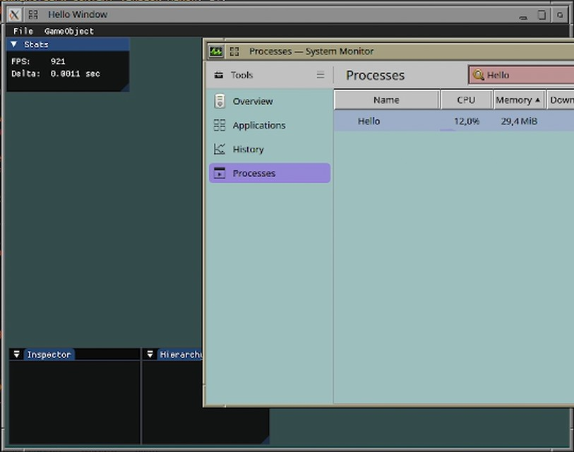
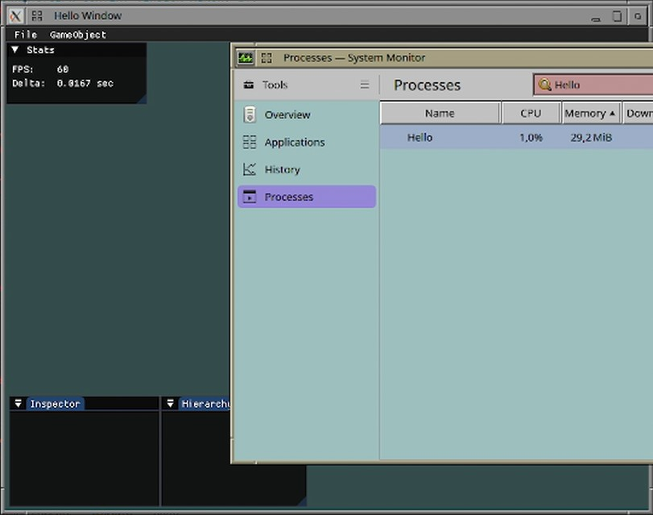

# Optimizations
The goal with this project is to start with the simplest and often least performant solutions. Then I can implement a type of benchmark and test the performance of the simple solution, improve upon it and then test again. I think this is a great way to learn, while building this project without getting stuck trying to run before I can walk, and to make sure the optimizations I want to implement actually make a difference and that I really understand that difference.

## Capping the Game Loop
The engine is still in a very basic state, so there is no multi-threading or anything like that. However, even though we are doing extremly little computation per game loop at this stage, I haven't setup anything to limit how frequently the game loops. Even though I have a 60 Hz display, the game could be updating into the 1000s of frames per second, which is a complete waste of my computer's resources. Here I want to look at how we can limit the computations so we don't overuse the CPU and drain the battery, when our game loop is processing faster than necessary.

I have measured the FPS using `std::chrono::steady_clock` and the CPU usage using System Monitor (KSysGuard).

### Uncapped
It turns out GLFW actually implements VSync by default, which caps the FPS at 60 (Because my monitor updates at 60HZ). This can be turned off using `glfwSwapInterval(0)`. 
With it turned off we can see how, to a user, the program operates exactly the same as it would without V-Sync (except it might produce screen tears if we rendered dynamic stuff), but it also consumes a lot more resources.

On my machine I get about 900 FPS and the CPU usage is about 12%.

### Capped by V-Sync
I'm not sure exactly how GLFW implements V-Sync, but it does seem to involve some form of sleep, since it caps my FPS at 60 and the CPU usage goes down as much as it does when I call sleep.
I did try to run the program using a busy wait just to be sure and, sure enough, with the busy-wait the CPU usage stays high, so it has to be putting the thread to sleep to get those results.

On my machine I get 60 FPS and the CPU usage is about 1%.

### Capped by Sleep
I implemented some [functionality that would cap the fps by putting the thread to sleep](https://github.com/Raestkjoot/G-Engine/blob/2d01c95c1ab0da8af33440d70e448d192031446a/Source/Main.cpp#L54). It's pretty simple and definitely shouldn't be used in an actual product. I could cap it at 60 FPS to get the same results as with V-Sync. 
This can be pretty useful though, for example if you want to make a casual game that only needs about 30 FPS, it would make a lot of sense to cap it there to avoid using unecessary resources and potentially draining a laptop's battery more than necessary.
To be production ready it would need a few more things though. If a frame is slower than the cap, it should skip that frame. 
Another thing to note is that sleep is not very accurate, so we might need to [use OS-specific sleep functions or find a library that implements precise sleep](https://stackoverflow.com/a/41862592) and make sure we don't miss a VBLANK because of inaccurate sleep.

On my machine I get 30 FPS and the CPU usage is about 0.5%

### Conclusion
I think for now I will simply go with V-Sync, since that gets the CPU usage down and works well out-of-the-box with GLFW. In the future it might make sense to take another look and try to implement multi-threading and precise sleep.
